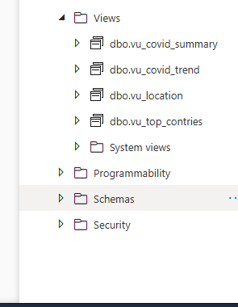
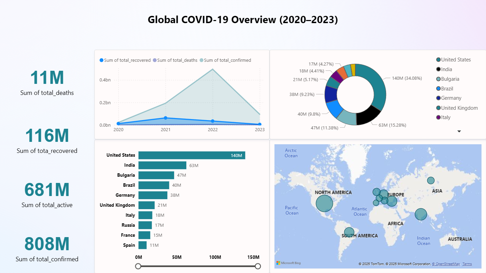

# Azure Synapse & Power BI: COVID-19 Data Insights (2020–2023)

This project showcases how to process, analyze, and visualize global **COVID-19 data** using **Microsoft Azure Synapse Analytics** and **Power BI**.  
It demonstrates the complete pipeline — from ETL and data modeling to dynamic dashboard visualization.

---

## 📖 Project Overview

The data contains detailed COVID-19 case records, including:
- Total Confirmed Cases  
- Total Deaths  
- Total Recovered  
- Country/Region and Temporal Information  

The **ETL process** was performed in **Azure Synapse**, transforming raw data into structured tables and views to support fast and efficient visualization in **Power BI**.

---

## ⚙️ Data Processing (ETL)

- Data was extracted from global COVID-19 datasets.  
- Transformations included data cleaning, aggregation, and summarization.  
- Data was loaded into a relational database schema within **Azure Synapse**.  
- A dedicated table `Covid_Info` stores the core dataset.  

### Database Views:
| View Name | Description |
|------------|-------------|
| `View_Summary` | Holds the total confirmed, deaths, recovered, and active numbers. |
| `View_Covid_Trend` | Shows total confirmed, deaths, and recoveries by year. |
| `View_Location` | Displays the top 10 countries by total confirmed cases. |
| `View_Top_Countries` | Highlights top 10 countries with highest confirmed and death counts. |

---

## 📊 Power BI Dashboard

### **Dashboard Title:**  
**Global COVID-19 Overview (2020–2023)**

### **Main KPIs Displayed:**
- **Total Confirmed:** 808M  
- **Total Active:** 681M  
- **Total Recovered:** 116M  
- **Total Deaths:** 11M  

### **Visual Components:**
1. **Line Chart** — Tracks global trend of confirmed, recovered, and death cases (2020–2023).  
2. **Donut Chart** — Displays the percentage share of top affected countries (e.g., USA, India, Brazil, UK).  
3. **Bar Chart** — Compares total confirmed cases among top 10 countries.  
4. **Map Visualization** — Geographical distribution of COVID-19 impact across continents.

All visuals are synchronized, offering clear insights into **global patterns and regional hotspots**.

---

## 🧰 Tools & Technologies

- **Microsoft Azure Synapse Analytics** — For data ingestion, cleaning, transformation, and querying.  
- **Microsoft Power BI** — For building the interactive dashboard and visual storytelling.  
- **SQL** — For data modeling, creating database views, and aggregations.

---

## 📈 Insights & Findings

- The **United States** had the highest number of confirmed cases (~140M).  
- **India** and **Brazil** followed with significant case counts.  
- Peak confirmed and death rates occurred around **2022**.  
- Recovery rates showed a clear upward trend across years.  

---

## 🧾 Conclusion

This project demonstrates the power of integrating **Azure Synapse Analytics** and **Power BI** to transform raw pandemic data into **actionable insights**.  
It highlights how cloud-based data pipelines and modern BI tools enable real-time decision-making and data storytelling.

---

## 👤 Author

**Mazen Sehsah** 
